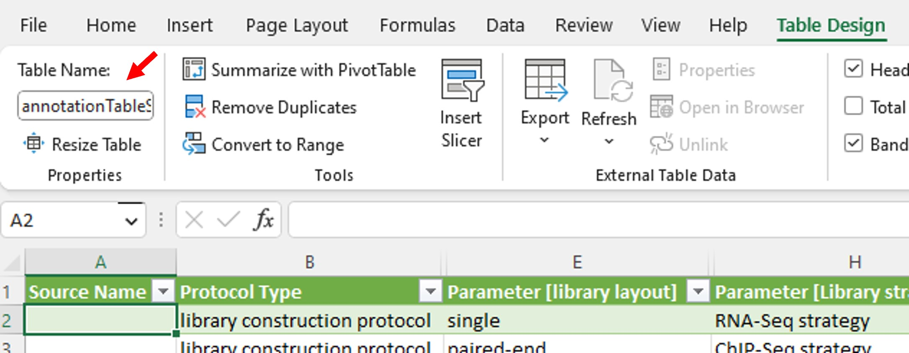
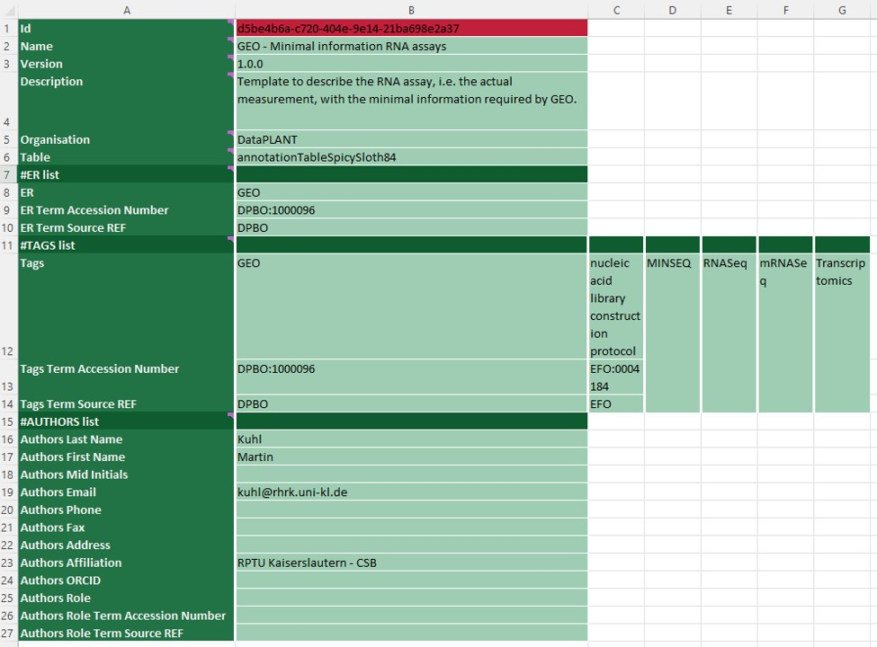

# Swate-templates

A collection of minimal information standard templates for Swate.

The templates in this repository are crawled by [Swobup](https://github.com/nfdi4plants/Swobup) and written into the production Swate database.

Anyone can access them via the [template search](https://nfdi4plants.github.io/Swate-docs/docs/UserDocs/Docs05-Templates.html) function.

---

# Contribution Guide

## Git Workflow to add or edit templates

1. Create issue with background information about the template you want to add. This also serves as place for discussion.
2. [Fork](https://docs.github.com/en/get-started/quickstart/fork-a-repo) this repository.
3. Create a feature branch.
3. [Clone](https://docs.github.com/en/repositories/creating-and-managing-repositories/cloning-a-repository) your fork-branch and add/update **ONE** new template.
4. Commit, push and [sync your branch](https://docs.github.com/en/pull-requests/collaborating-with-pull-requests/working-with-forks/syncing-a-fork).
    - 👀 Add your issue id (for example #32) to your commit so it is automatically linked.
5. Open a [pull request](https://docs.github.com/en/pull-requests/collaborating-with-pull-requests/proposing-changes-to-your-work-with-pull-requests/about-pull-requests) **referencing your issue**. :tada:

## Template

1. Create a new .xlsx file in the correct folder (check the subfolder README.md files).
2. If not done already [install Swate](https://nfdi4plants.github.io/Swate-docs/docs/UserDocs/Docs01-Installing-Swate.html) and create an [Annotation Table](https://nfdi4plants.github.io/Swate-docs/docs/UserDocs/Docs02-Annotation-Table.html).
3. [Add building blocks](https://nfdi4plants.github.io/Swate-docs/docs/UserDocs/Docs03-Building-Blocks.html). If you are unsure of which columns to add:
    - keep the template as concise as possible
    - if you add a template with a specific endpoint repository (ER) in mind, you may want to add columns that match the required fields of this ER
    - if you add a template because the research/methodical topic is missing, try to add columns that cover experimental procedures (as Parameters) and features of the sample (as Characteristics) that the experimenter would do when working on an experiment of that type
4. After you are done with the table, you have to add a SwateMetadataSheet: Click on the "Template Metadata" tab in **Swate Experts** and click "Create Metadata". A new worksheet will open.
5. The metadata sheet contains some fields which will be described in the following. Make sure to never change any of the fields in the first column. These "key" fields must exist to create a functional template. Always only change the "value" fields (second and following columns).
    - **Id**: Never change this field. It maps your template to a database entry.
    - **Name**: This is what users will see first of your template, try using a short, descriptive and human readable name. (Think YouTube video title)
    - **Version**: The versioning follows the [SemVer](https://semver.org/) convention. For a new templates use `1.0.0`, or raise the version number if you update an existing template.
    - **Description**: Here you can describe your template. Users interested in your template can read this in Swate, but not search by it.
    - **Organisation**: The name of an organisation you want to provide this template for. This facilitates searching for relevant templates in a specific organisation or community. Templates with the organisation "DataPLANT" are listed as "curated" in the Swate template database. All other templates are listed as community.
    - **Table**: This value must match the name of the annotation table you want to use as a template. To find the name click on any field in your annotation table, then "Table Design". Copy the name to the "Table" value field.
    
    - **ER list**: You can add any number of endpoint repositories to which your template complies here. You may want to add them as ontology terms with unique identifier and source.
    - **TAGS list**: You can add any number of tags here. These tags are used to search for your template. You may want to add them as ontology terms with unique identifier and source.
    - **AUTHORS list**: Add your name/alias here with as much information as you like.
    - Example:
    
10. Close the file and give it an appropriate name (naming convention is work in progress).

Well done! :tada: You created a new template. 

### Recommended best practices

- Try to think about in which order the experimenter in the lab will do their work. Try to match this chronological order from left to right. The normal order of the columns is: **Source Name** -> (all the Parameters and Characteristics in between in chronological order) -> **Sample Name** -or- **Raw Data File** -or- **Derived Data File**. This step is optional and only meant to increase readability.
- Below the header you can add exemplary terms as in this example:  
  
These examples help as additional information for other Data Stewards and are not transferred into the Swate template database.
- Use ontology terms for **ER list** and **TAGS list**.
- Add protocol type and any [minimal information standards](https://en.wikipedia.org/wiki/Minimum_information_standard) your template complies with to the **TAGS list**.