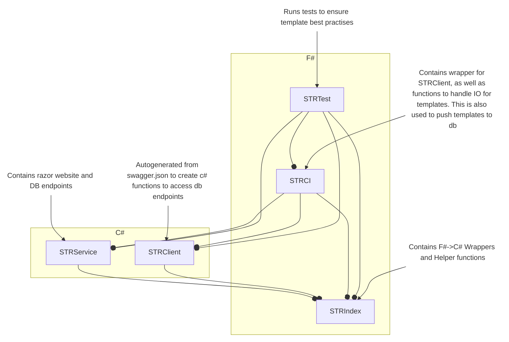

```mermaid
flowchart TD
 subgraph s1["F#"]
        n2["STRIndex"]
        n4["STRCI"]
        n6["STRTest"]
  end
 subgraph s2["C#"]
        n1["STRClient"]
        n5["STRService"]
  end
    n5 --o n2
    n1 --o n2
    n4 --o n2 & n5 & n1
    n6 --o n4 & n5 & n2 & n1
    n7["Contains F#-&gt;C# Wrappers and Helper functions"] --> n2
    n8["Contains wrapper for STRClient, as well as functions to handle IO for templates. This is also used to push templates to db"] --> n4
    n9["Contains razor website and DB endpoints"] --> n5
    n10["Autogenerated from swagger.json to create c# functions to access db endpoints"] --> n1
    n11["Runs tests to ensure template best practises"] --> n6

    n2@{ shape: rect}
    n4@{ shape: rect}
    n6@{ shape: rect}
    n1@{ shape: rect}
    n5@{ shape: rect}
    n7@{ shape: text}
    n8@{ shape: text}
    n9@{ shape: text}
    n10@{ shape: text}
    n11@{ shape: text}
```