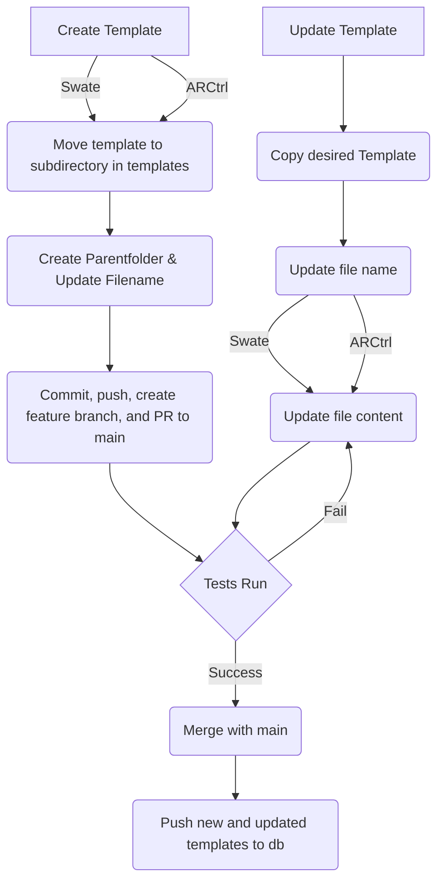

# Workflow

```mermaid
    flowchart TD
    A[Create Template] -->|Swate| B(Move template to subdirectory in templates)
    A --> |ARCtrl| B
    B --> C(Create Parentfolder & Update Filename)
    C --> D(Commit, push, create feature branch, and PR to main)
    D --> E{Tests Run}
    1[Update Template] --> 2(Copy desired Template)
    2 --> 3(Update file name)
    3 --> |Swate| 4(Update file content)
    3 --> |ARCtrl| 4(Update file content)
    4 --> E{Tests Run}
    E --> |Fail|4
    E --> |Success| F(Merge with main)
    F --> G(Push new and updated templates to db)
```