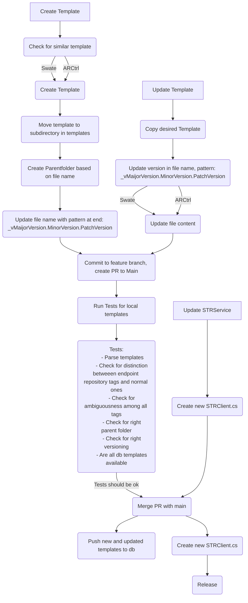

```mermaid
    flowchart TD
    A[Create Template] --> B(Check for similar template)
    B --> |Swate| C(Create Template)
    B --> |ARCtrl| C(Create Template)
    C --> D(Move template to subdirectory in templates)
    D --> E(Create Parentfolder based on file name)
    E --> F(Update file name with pattern at end: _vMaijorVersion.MinorVersion.PatchVersion)
    AA[Update Template] --> BB(Copy desired Template)
    BB --> CC(Update version in file name, pattern: _vMaijorVersion.MinorVersion.PatchVersion)
    CC --> |Swate| DD(Update file content)
    CC --> |ARCtrl| DD(Update file content)
    F --> G(Commit to feature branch, create PR to Main)
    DD --> G
    G --> H(Run Tests for local templates)
    H --> I(Tests:
        - Parse templates
        - Check for distinction betweeen endpoint repository tags and normal ones
        - Check for ambiguousness among all tags
        - Check for right parent folder
        - Check for right versioning
        - Are all db templates available
        )
    I --> |Tests should be ok| J(Merge PR with main)
    J --> K(Push new and updated templates to db)
    AAA[Update STRService] --> BBB(Create new STRClient.cs)
    BBB -->J
    J --> M(Create new STRClient.cs)
    M --> N(Release)
```