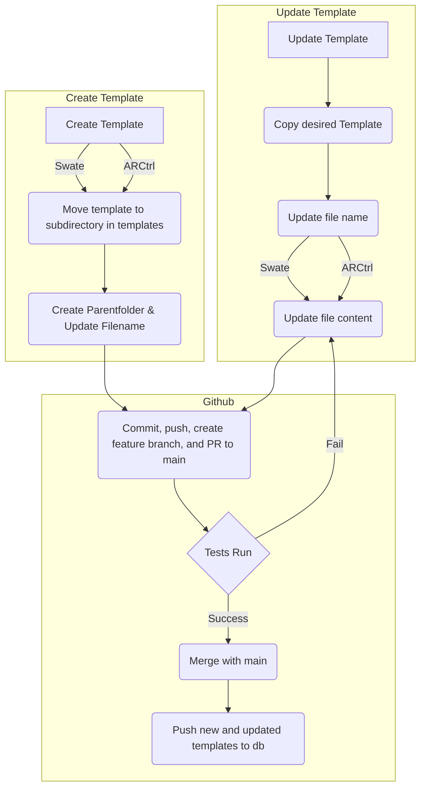

# Workflow

```mermaid
    flowchart TD
    subgraph s1["Create Template"]
        A[Create Template] -->|Swate| B(Move template to subdirectory in templates)
        A --> |ARCtrl| B
        B --> C(Create Parentfolder & Update Filename)
    end
    subgraph s2["Update Template"]
        1[Update Template] --> 2(Copy desired Template)
        2 --> 3(Update file name)
        3 --> |Swate| 4(Update file content)
        3 --> |ARCtrl| 4(Update file content)
    end
    subgraph s3["Github"]
        C --> D(Commit, push, create feature branch, and PR to main)
        4 --> D
        D --> E{Tests Run}
        E --> |Fail|4
        E --> |Success| F(Merge with main)
        F --> G(Push new and updated templates to db)
    end
```