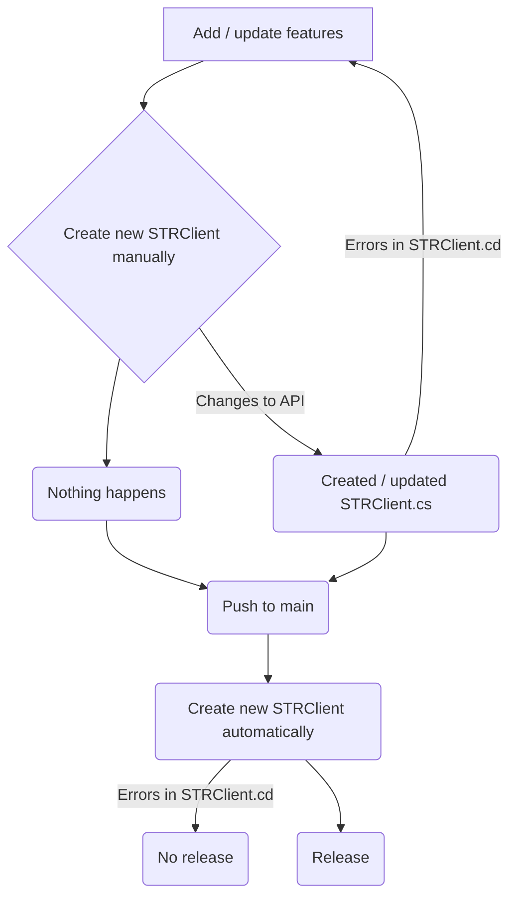

# STR Client

.NET client library for https://str.nfdi4plants.org.
 
Generated with NSwag based on the OpenAPI specification.

## (Re)generate client

in project root of STRClient you can use one of these options, depending on the nswag version you have installed:

```bash
<path to nswag tool>\NSwag\Net80\dotnet-nswag.exe openapi2csclient /input:https://str.nfdi4plants.org/swagger/v1/swagger.json /namespace:STRClient /output:STRClient.cs
```

or

```bash
nswag openapi2csclient /input:https://str.nfdi4plants.org/swagger/v1/swagger.json /output:STRClient.cs /namespace:STRClient
```

# Workflow


